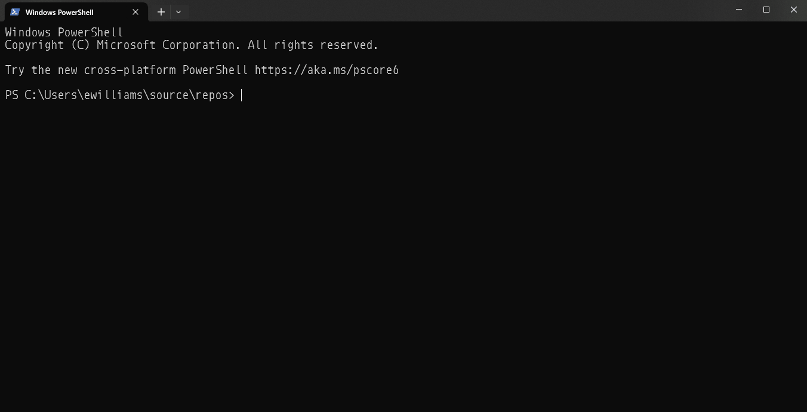

# kangaroo Network Scanner
 
 

[](https://github.com/ewilliams0305/kangaroo/issues)


*"Kangaroos have large, powerful hind legs, large feet adapted for leaping"*


The kangaroo network scanner supports (or will support) the following features. 

  


   



## Table of Contents
1. [Building Scanners](#Building)
2. [Scanning Networks](#Scanning-Networks)

# Building
Kangaroo leverages the builder pattern to ensure its configured correctly before usage. 

*begin with a ScannerBuilder.Configure() method*
``` csharp
// IScanner implements IDisposable so optionally use a using statement
using var scanner = ScannerBuilder.Configure()
```
If no additional options are provided the kangaroo will grab your first up network interface and use that subnet for scans. **(lies, not yet)**

Begin chaining addition options together as depicted. 

``` csharp
using var scanner = ScannerBuilder
    .Configure()
    .WithAddresses([ip1, ip2, ip3...])
    .WithParallelism(numberOfBatches: 10)
    .WithNodeTimeout(TimeSpan.FromMilliseconds(250))
    .WithLogging(
        LoggerFactory.Create(builder =>
        {
            builder.AddConsole();
        }))
    .Build();

var nodes = await scanner.QueryNetwork();
Console.WriteLine(nodes.Dump());
```

## IP Configuration
Optionally kangaroo can use specific IPs, a range of IPs, or scan an entire subnet

*ip address collection*
``` csharp
using var scanner = ScannerBuilder
    .Configure()
    .WithAddresses([ip1, ip2, ip3...]) // provide an IEnerable of IP addresses
    .Build();
```

*subnetmask*
``` csharp
using var scanner = ScannerBuilder
    .Configure()
    .WithSubnet("10.0.0.0", "255.255.255.0") // provide an ip subnet to scan
    .Build();
```

*network interface*
``` csharp
using var scanner = ScannerBuilder
    .Configure()
    .withInterface(ethernet2) // provide an adapter to determine a subnet (optinal string name)
    .Build();
```

*range of ips*
``` csharp
using var scanner = ScannerBuilder
    .Configure()
    .WithRange(startIpAddress, endIpAddress) // provide a start and end address to scan a range of IPs 
    .Build();
```

## Web Server Query
An optional web server query can be enabled.  Use the `WithHttpScan` option after configuring the addresses.
In order to prevent port or dns exhaustion the scan depends on a `Func<HttpClient>`.  You can use this function to create an http client pool,
leverage the http client factory, or simply return a new client.  Each query will request a client and dispose of the client afterwards.

```csharp
 var scanner = config
    .WithInterface(adapter)
    .WithHttpScan(() => new HttpClient())
    .Build();
```

## Ping Configuration
The ping can be configured as well. optional timeout and TTL can be provided to effectively speed up or slow down each query. A shorter timeout will allow kangaroo to fail faster on an unknown address. The TTL can be configured to ensure you are only scanning IP addresses within a physical boundary. A TTL of 1 would only ping devices on the physical switch. 

``` csharp
using var scanner = ScannerBuilder.Configure()
  .WithIpAddresses(ips)
  .WithMaxTimeout(TimeSpan.FromSeconds(1))
.Build();
```

``` csharp
using var scanner = ScannerBuilder.Configure()
  .WithIpAddresses(ips)
  .WithMaxHops(2)
.Build();
```

## Parallel Configuration

After the ips are determined you can optionally execute the scans using the TPL, add the WithParallelism 
method and provide a batch size. Each batch of IP addresses will be scanned in parellel. Each batch will contsin the number of IP addresses divided by the size of the provided addresses. 
``` csharp
using var scanner = ScannerBuilder
    .Configure()
    .WithAddresses(ips)
    .WithParallelism(numberOfBatches: 10) // of 254 addresses 25 batches of 10 addresses will be scanned.  
    .Build();
```

## Logging Configuration
BYOL(Logger) 

``` csharp
using var scanner = ScannerBuilder.Configure()
  .WithIpAddresses(ips)
  .WithLogging(_logger)  //Provide a logger
.Build();
```

``` csharp
using var scanner = ScannerBuilder.Configure()
  .WithIpAddresses(ips)
  .WithLogging(() => ILogger)  //Provide a logger func
.Build();
```

# Scanning Networks
So now you have a new Kangaroo Scanner. lets scan, await a call to `QueryAddresses(optionalCtx)` to return a `ScanResult` containing a list of network nodes, and scan results. 

``` csharp
var nodes = await scanner.QueryNetwork();
Console.WriteLine(nodes.Dump());
```

## Network Protocols 

### ICMP
The first scan kangaroo will execute is a simple ping (or icmp) query. 
Depending on the ping configuration the kangaroo scanner will send icmp packets 
to the specified IP addresses and wait for a reply. The ping test is used to determin if the 
endpoint is currently up, and the latency of the node. When and only when a Ping is replied 
too, kangaroo will attempt to perform additional tests. 

### ARP
The next step in the network query involves an arp request. When an endpoint responds the MAC address
of the network node will be gathered. 

### NETBIOS / Hostname
After collecting the icmp results and mac address, kangaroo will attempt to gather the netbios information by sending
and output packet over UDP port 137. Should the endpoint respond with hostname information the data is parsed and
collected. Results may very...

### WEB Server
The last and final optional step includes an http query. The goal of this query is simply to determine if an http webserver 
exist at that endpoint and report the servers headers. For this test an HTTP GET request on port 80 is made to the 
servers IP address root `GET http://172.22.5.5/`. If any response is return the headers will queried to dertmine the type of webserver. 

## IP Scanning
Await a call to the QueryNetwork to query all the IP addresses provided.  Depending on the configuration each query could take anywhere from 5 seconds to several minutes.  The reslts will include an IEnumerable of nodes each containing the following data. Note, the hostname results depend on the network environment and machine running the scanner. 

```csharp
public record NetworkNode(
    IPAddress IpAddress,    // IP address that was queried
    MacAddress MacAddress,  // MAC address return from arp request
    string? HostName,       // Hostname return from the query
    string? WebServer,      // HTTP server header information (future) 
    TimeSpan? Latency,      // Ping response time
    TimeSpan QueryTime,     // Elapsed time for the duration of thr query
    bool Alive);            // True if the endpoint replied to ping
```

## Nodes
Individual nodes can be queried as well.
``` csharp
var node = await scanner.CheckNetworkNode();
Console.WriteLine(node.Dump());
```

## Scan Results
The results of each scan will include the elapsed time and other properties.

## Port Scanner
(Future!)
